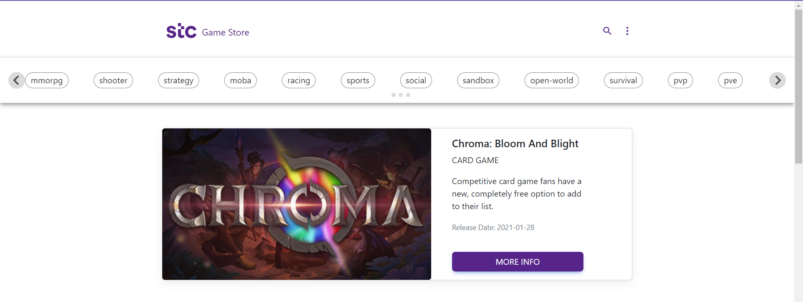
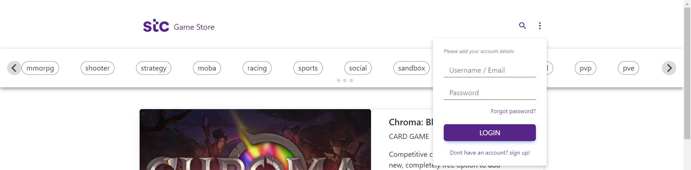
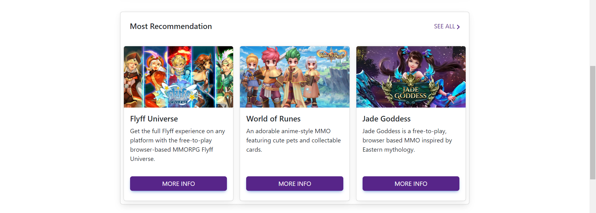
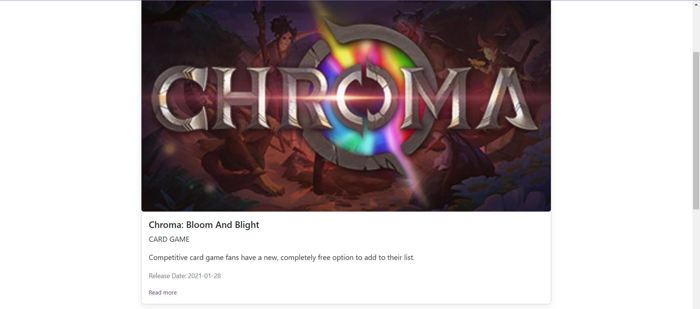
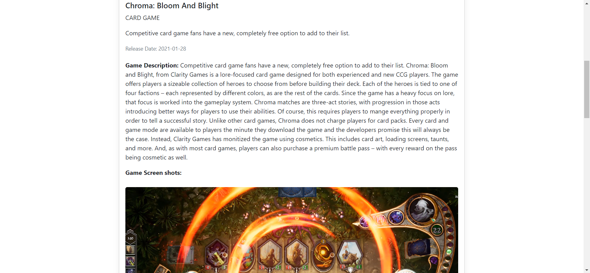
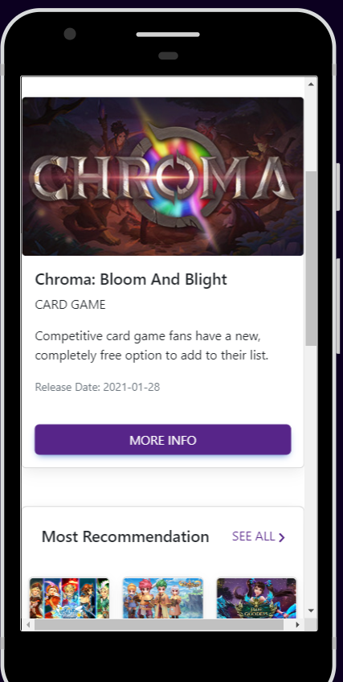

# gamestore

A public SPA that list games and display a detailed page for each game, user can see the details page by clicking on any game in the homepage

## Technologies used

- VueJS
- Pinia (state management)

## Project setup

```
npm install
```

### Screenshots







